 

Pre-final year CS student (AI & ML) at VIT, with hands-on production experience. I work across the full stack — from shipping client-facing Next.js apps with heavy animation to building YOLOv5-based computer vision pipelines and agentic workflows in Python. Comfortable going from a Figma file to a deployed ML-integrated web product.

Currently interested in: autonomous agents, multimodal models, and real-time 3D on the web.

---

**Projects**

| | |
|---|---|
| [**Liquinex-reborn**](https://github.com/Nithissh22/Liquinex-reborn) | Rebuilt a client web product from the ground up — performance-first, animation-heavy, GSAP + Next.js |
| [**Codemeshflow-nitz**](https://github.com/Nithissh22/Codemeshflow-nitz) | Agentic workflow orchestration tool — Python backend, LLM-driven task graph execution |
| [**coralreef-antigravity**](https://github.com/Nithissh22/coralreef-antigravity) | Computer vision pipeline for environmental analysis — YOLOv5, Flask API, React frontend |

---

**Stack**

`TypeScript` `Python` `Next.js` `React` `Node.js` `Flask` `PostgreSQL` `PyTorch` `YOLOv5` `Docker` `GSAP` `Three.js`

---

**Stats**

  
  

  

 

  <picture>
    <source media="(prefers-color-scheme: dark)" srcset="https://raw.githubusercontent.com/Nithissh22/Nithissh22/output/github-contribution-grid-snake-dark.svg">
    <source media="(prefers-color-scheme: light)" srcset="https://raw.githubusercontent.com/Nithissh22/Nithissh22/output/github-contribution-grid-snake.svg">
    
  </picture>

---

  
  &nbsp;
  

